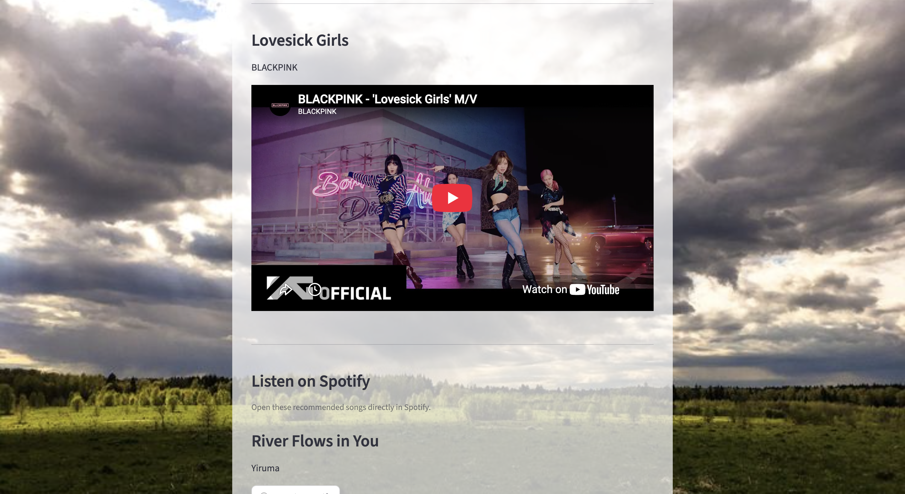
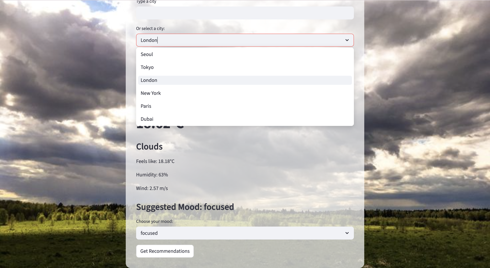
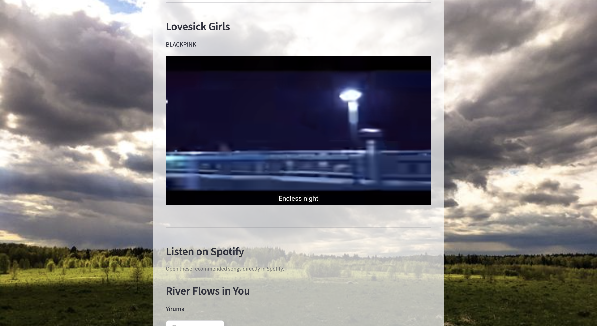
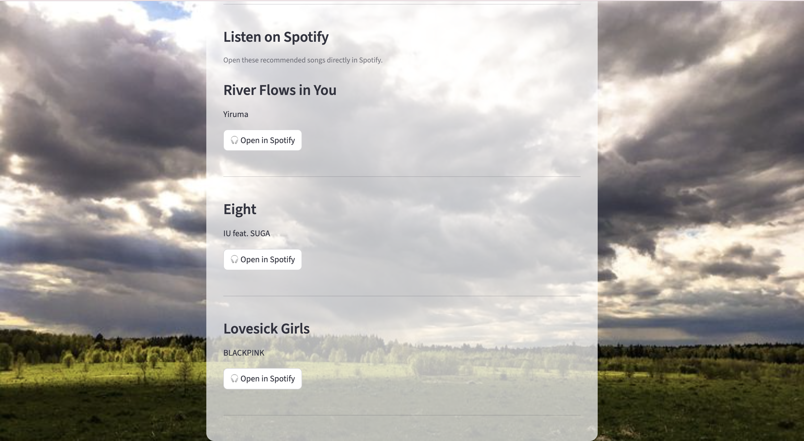

# Mood Music Recommender

A Streamlit app that recommends music using mood, weather, and audio features. It combines a local song catalog with optional Spotify search results and uses weather conditions to suggest a starting mood.

## Features

- Choose a city or enter a custom city.
- Use current weather to suggest a mood.
- Select from happy, sad, energetic, calm, and focused moods.
- Get recommendations from the local CSV catalog.
- Get additional Spotify recommendations when Spotify API access is configured.
- Display weather-based background images.

## Visual Preview

The app changes its background based on the current weather:

<p align="center">
	
	
	
</p>

## Showcase Example

Example recommendations for London with three songs, including the weather forecast, local YouTube recommendations, and Spotify results.

### Recommended Songs

<p align="center">
	
</p>

### Mood

<p align="center">
	
</p>

### YouTube Player

<p align="center">
	
</p>

### Spotify Recommendations

<p align="center">
	
</p>

## Project Structure

```text
.
|-- app.py
|-- assets/
|   |-- cloudy.jpeg
|   |-- default.jpeg
|   |-- rain.jpeg
|   |-- snow.jpeg
|   |-- sunny.jpeg
|   |-- recommended-songs.png
|   |-- youtube-player.png
|   `-- spotify-recommendations.png
|-- data/
|   `-- songs.csv
|-- utils/
|   |-- recommender.py
|   |-- spotify_api.py
|   `-- weather.py
|-- requirements.txt
`-- README.md
```

## Requirements

- Python 3.12 or newer
- A virtual environment is recommended.
- API keys are optional for the local dataset, but required for live weather and Spotify recommendations.

## Installation

Create and activate a virtual environment, then install the dependencies:

```bash
python3 -m venv venv
source venv/bin/activate
pip install -r requirements.txt
```

## Private API Configuration

Create a `.env` file in the project root. Do not commit this file or share its contents:

```env
OPENWEATHERMAP_API_KEY=your_openweathermap_api_key
SPOTIFY_CLIENT_ID=your_spotify_client_id
SPOTIFY_CLIENT_SECRET=your_spotify_client_secret
```

The application loads these values from environment variables. `.env` is already listed in `.gitignore`.

API keys can be obtained from:

- [OpenWeatherMap API keys](https://home.openweathermap.org/api_keys)
- [Spotify Developer Dashboard](https://developer.spotify.com/dashboard)

Spotify API access may require an active Premium subscription for the account that owns the developer app.

## Run the App

From the project root, run:

```bash
streamlit run app.py
```

Then open the local URL shown by Streamlit, usually `http://localhost:8501`.

## Without API Keys

The local song recommendations can still be used without API keys. Weather data will be unavailable without an OpenWeatherMap key, and Spotify recommendations will be unavailable without valid Spotify credentials.

## Data Format

Local songs are stored in `data/songs.csv` with these columns:

```text
song,artist,mood,energy,valence,link
```

`energy` and `valence` are numeric values between 0 and 1 and are used by the recommendation logic.
